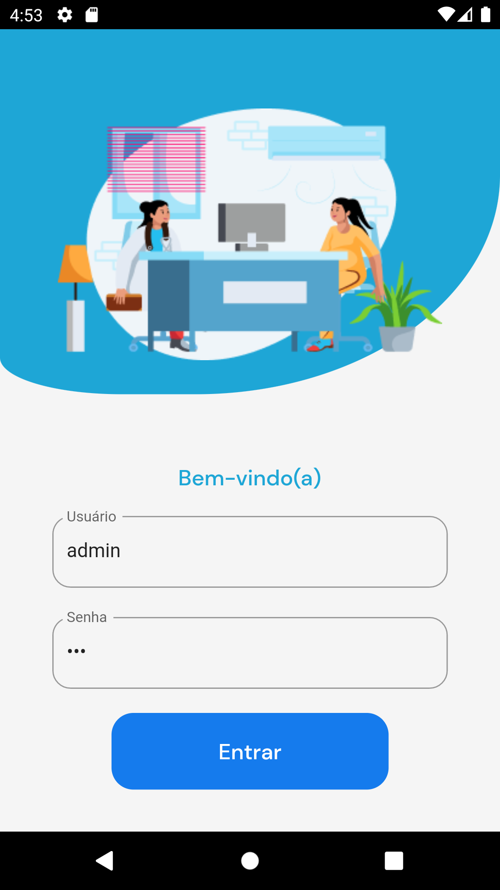
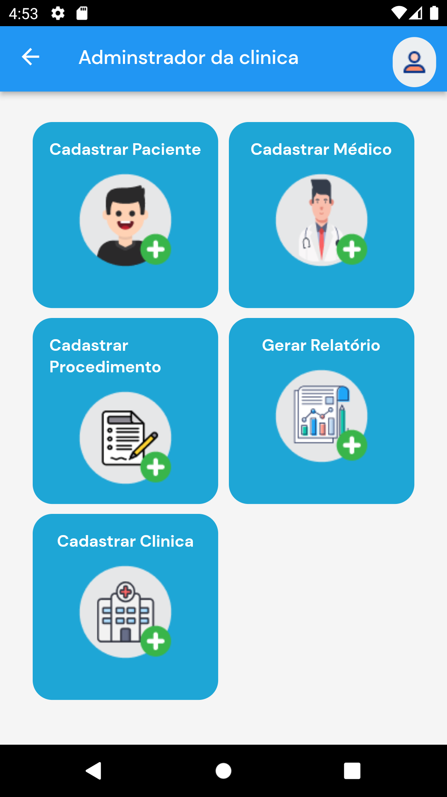
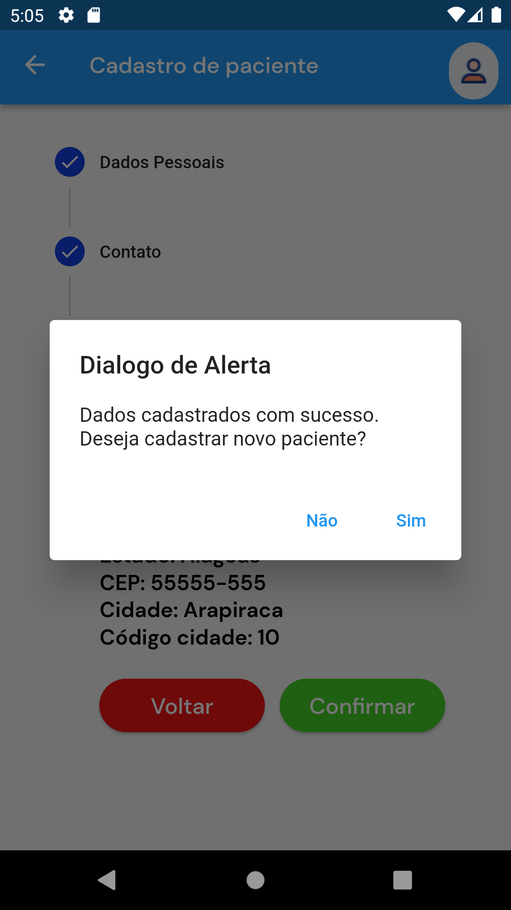
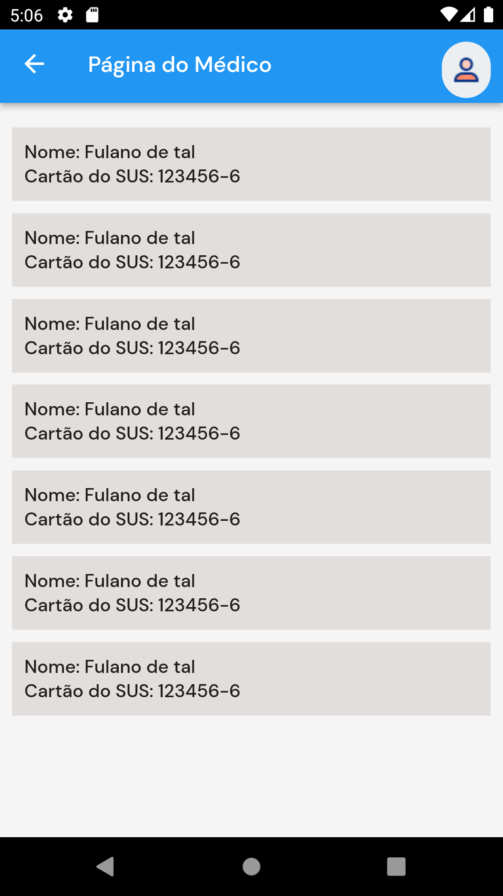

# Atividade Curricular de Extensão (ACE) - Clinica de fisioterapia

## Sobre o projeto
> Este projeto foi proposto pela disciplina de Atividade Curricular de Extensão, ACE, da Universidade Federal de Alagoas – UFAL. Esta ACE tinha o objetivo de mostrar as etapas do processo de desenvolvimento de software, do levantamento de requisitos a codificação do projeto.
> A proposta era fazer um app para uma clínica de fisioterapia, então, tivemos contato com o responsável da clinica e assim foi feito o levantamento de requisitos e todas as etapas necessárias. 

### Etapas
> 1 – Levantamento de requisitos;
> 2 – Prototipação das telas baseada no levantamento de requisitos, utilizei o figma;
> 3 – Aprovação por parte do cliente;
> 4 – codificação;

## Tecnologias 
> Dart 2.17.1
> Flutter 3.0.1

### Pacote utilizado
> google_fonts: ^2.3.2

## Login

	

## Página do administrador da clínica 

 
  

## Cadastro de paciente

	

## Caixa de dialogo

	

## Página do médico

	

